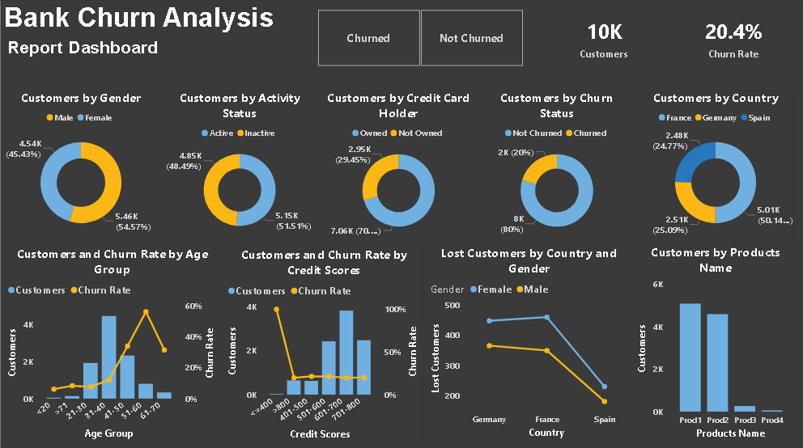

# 📊 Bank Churn Analysis Dashboard

## 🔍 Overview

This Power BI project analyzes customer churn behavior in a banking dataset to identify key factors affecting customer retention.

## 📈 Key Insights

- Inactive customers have a significantly higher churn rate
- Customers aged 50+ are more likely to leave the bank
- Germany shows the highest churn among all regions
- Customers with low credit scores are high-risk

💡 Business Recommendations

- Target inactive users with engagement campaigns
- Provide personalized offers to high-risk age groups
- Improve services in high churn regions
- Monitor low credit score customers closely

## 📊 Dashboard Features

* Customer segmentation (Gender, Country)
* Churn analysis by Age Group
* Credit Score impact on churn
* Product usage insights
* Activity status analysis

## 🛠 Tools & Technologies

* Power BI
* Data Visualization
* Data Analysis

## 📷 Dashboard Preview

## 🚀 How to Use

1. Download the `.pbix` file
2. Open in Power BI Desktop
3. Interact with filters and visuals

## 📌 Project Objective

To help banks reduce customer churn by identifying high-risk segments and improving retention strategies.

